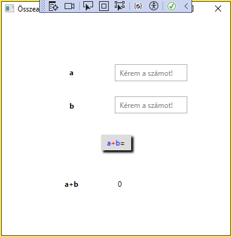
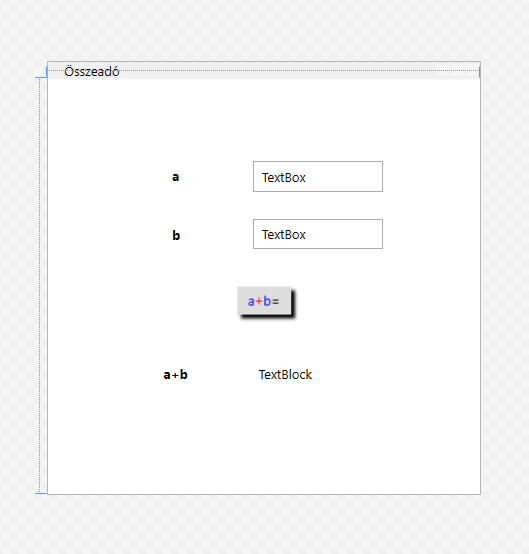
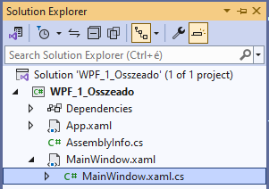
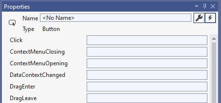
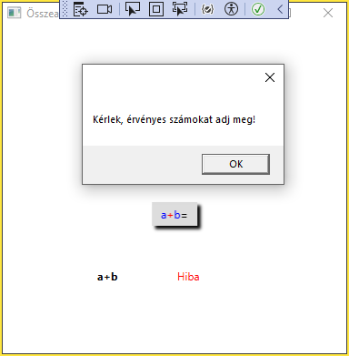

# 10. Modul Összeadó készítése (Windows Presentation Foundation)

-https://www.visualstudio.com/vs/community/

-GUI framework, ami lehetővé teszi grafikus alkalmazások készítését GUI elemek széles skáláját felhasználva

-WPF <> WinForm

-WPF = XAML (markup) + XAML.CS kombinációja

-XAML = eXtensible Application Markup Language. Ez egy jelölőnyelv, amelyet a felhasználói felület (UI) leírására használnak. XAML segítségével meghatározhatod az ablakok, gombok, szövegdobozok és egyéb vizuális elemek elrendezését és megjelenését

-XAML.CS = Ez a háttérkód, amely az interakciókat, a logikát és a funkcionalitást biztosítja. A C# kód felelős az események kezeléséért, az adatok feldolgozásáért és az alkalmazás működéséért.

-Minden egy szerkezetleírás: X.xaml és egy eseménykezelő: X.xaml.cs párosból áll.


# Feladat: egyszerű összeadó gép




New Project/WPF Application (WPF_1_Osszeado)

-View/Toolbox

-View/Properties

## Szerkezet (vezérlők):

MainWindox.xaml

*namespace: WPF_1_Osszeado*!

```c#
<Window x:Class="WPF_1_Osszeado.MainWindow"
        xmlns="http://schemas.microsoft.com/winfx/2006/xaml/presentation"
        xmlns:x="http://schemas.microsoft.com/winfx/2006/xaml"
        xmlns:d="http://schemas.microsoft.com/expression/blend/2008"
        xmlns:mc="http://schemas.openxmlformats.org/markup-compatibility/2006"
        xmlns:local="clr-namespace:WPF_1_Osszeado"
        mc:Ignorable="d"
        Title="MainWindow" Height="450" Width="800">
    <Grid>

    </Grid>
</Window>
```
Vezérlők felhelyezése az ablakra (egyenlőre csak az illesztési segédvonalak használatával)

Az XAML kis-nagybetű érzékeny, mert minden vezérlő elem neve vagy egy attribútum neve egy .NET keretrendszerben definiált típushoz van hozzárendelve. 




-`Window`

XAML-ben:
`Title="Összeadó"`
vagy 
>Properties/Common/Title

>Properties/Layout/Width|Height
Vezérlő szélessége és magassága (métékegység eszközpont)

-`Label`: szöveg megjelenítése űrlapon, target-je van, van speciális eseménye

`<Label></Label>` vagy `<Label />`

A Label contentjének megadásának 4 módszere:

`<Label>a</Label>`

`<Label Content="a" />`

```c#
<Label>
    <Label.FontWeight>Bold</Label.FontWeight>
    <Label.Content>a</Label.Content>
</Label>
```

>Properties/Common/Content
Elem felirata

**Fontosabb egyéb Property-k:**
>Properties/Text/Bold
Felirat félkövér

>Properties/Layout/Margin:
HorizontalAlignment és a VerticalAlignment beállításától függően az elem helyét adja
(Top, Left)

>Properties/Layout/HorizontalContentAlignment|VerticalContentAlignment
Vezérlő tartalmának igazítása

>Properties/Layout/Padding:
Belső margó méretei

-`TextBox`: szöveg input

-`TextBlock`: statikus, nagyobb mennyiségű szöveg megjelenítése, többsoros szöveg megjelenítése
>Properties/Text/TextWrapping
Szöveg automatikus tördelése


-`Button`
>Properties/Appearance/BorderThickness
Keret

>Properties/Appearance/Effect
Árnyék adása a vezérlőhöz: DropShadowEffect

-`Wrappanel`: A WrapPanel egy WPF konténer, amely a gyermekelemeket vízszintesen vagy függőlegesen helyezi el, és automatikusan új sorba vagy oszlopba tör, ha a rendelkezésre álló hely elfogy.
```c#
<Button HorizontalAlignment="Left" Margin="264,217,0,0" VerticalAlignment="Top">
    <Button.Content>
        <WrapPanel Orientation="Horizontal">
            <TextBlock Foreground="Blue">a</TextBlock>
            <TextBlock Foreground="Red">+</TextBlock>
            <TextBlock Foreground="Blue">b</TextBlock>
            <TextBlock>=</TextBlock>
        </WrapPanel>
    </Button.Content>
</Button>
```
<details>
<summary>Nyiss le a MainWindox.xaml forrásáért!</summary>

### `MainWindox.xaml` példa:
```c#
<Window x:Class="WPF_1_Osszeado.MainWindow"
        xmlns="http://schemas.microsoft.com/winfx/2006/xaml/presentation"
        xmlns:x="http://schemas.microsoft.com/winfx/2006/xaml"
        xmlns:d="http://schemas.microsoft.com/expression/blend/2008"
        xmlns:mc="http://schemas.openxmlformats.org/markup-compatibility/2006"
        xmlns:local="clr-namespace:WPF_1_Osszeado"
        mc:Ignorable="d"
        Title="Összeadó" Height="400" Width="400">
    <Grid>
        <Label HorizontalAlignment="Left" Margin="110,76,0,0" VerticalAlignment="Top">
            <Label.FontWeight>Bold</Label.FontWeight>
            <Label.Content>a</Label.Content>
        </Label>
        <Label Content="b" HorizontalAlignment="Left" Margin="110,131,0,0" VerticalAlignment="Top" FontWeight="Bold"/>
        <Label Content="a+b" HorizontalAlignment="Left" Margin="102,260,0,0" VerticalAlignment="Top" FontWeight="Bold"/>
        <TextBox HorizontalAlignment="Left" Margin="190,76,0,0" TextWrapping="Wrap" Text="TextBox" VerticalAlignment="Top" Width="120" Padding="5,5,5,5"/>
        <TextBox HorizontalAlignment="Left" Margin="190,129,0,0" TextWrapping="Wrap" Text="TextBox" VerticalAlignment="Top" Width="120" Padding="5,5,5,5"/>
        <Button Margin="0,192,0,0" VerticalAlignment="Top" HorizontalAlignment="Center" Padding="10,5,10,5" BorderThickness="0,0,0,0">
            <Button.Effect>
                <DropShadowEffect/>
            </Button.Effect>
            <Button.Content>
                <WrapPanel>
                    <TextBlock Foreground="Blue">a</TextBlock>
                    <TextBlock Foreground="Red">+</TextBlock>
                    <TextBlock Foreground="Blue">b</TextBlock>
                    <TextBlock>=</TextBlock>
                </WrapPanel>
            </Button.Content>
        </Button>

        <TextBlock HorizontalAlignment="Left" Margin="190,260,0,0" TextWrapping="Wrap" Text="TextBlock" VerticalAlignment="Top" Padding="5,5,5,5" Width="120"/>

    </Grid>
</Window>
```
</details>

## Eseménykezelés (events)



MainWindox.xaml.cs
```c#
using System.Text;
using System.Windows;
using System.Windows.Controls;
using System.Windows.Data;
using System.Windows.Documents;
using System.Windows.Input;
using System.Windows.Media;
using System.Windows.Media.Imaging;
using System.Windows.Navigation;
using System.Windows.Shapes;

namespace WPF_1_Osszeado
{
    /// <summary>
    /// Interaction logic for MainWindow.xaml
    /// </summary>
    public partial class MainWindow : Window
    {
        public MainWindow()
        {
            InitializeComponent();
        }
    }
}
```

Azt szeretnénk, ha rákattintanak a Button-ra, akkor 
-olvassa ki az egyes TextBox-ok tartalmát egy-egy int változóba (a,b), 
-számolja ki a két szám összegét (c)
-írja ki az eredményt a TextBlock-ba

1. lépés

Szükséges vezérlők egyedi `Name` tulajdonságainak beállítása
Válaszd ki a vezérlőt és a Properties/Name mezőjébe írd be a következőket (PascalCase írásmód, legyen benne a vezérlő típusa is!):
InputATextBox, InputBTextBox, OutputCTextBlock 
Most ugyan csak egy Button-unk van, de nevezzük el azt is
AddButton 

2. lépés
Kattintsunk a Properties ablakban az Events ikonra 



A Button-on állva kattintsunk a Click eseménybe 2x (egyébként ha a vezérlőn 2x kattintunk-akár véletlenül- akkor a default eventhandler -rel automatikusan a cs-be lép!)

```c#
private void AddButton_Click(object sender, RoutedEventArgs e)
{

}
```

3. lépés
Eseménykezelő megírása

```c#
private void AddButton_Click(object sender, RoutedEventArgs e){
    try
    {
        int a = int.Parse(InputATextBox.Text);
        int b = int.Parse(InputBTextBox.Text);
        int c = a + b;
        OutputCTextBlock.Text = c.ToString();
    }
    catch
    {
        OutputCTextBlock.Foreground = Brushes.Red;
        OutputCTextBlock.Text = "Hiba";
        MessageBox.Show("Kérlek, érvényes számokat adj meg!");
        OutputCTextBlock.Foreground = Brushes.Black;
        OutputCTextBlock.Text = "0";
    }
}
```

Ahol a `catch` ágban az történik, hogy az eredmény helyére pirosan kiírjuk a "Hiba" szöveget, és megjelenítünk egy modális ablakot<span style="text-decoration: underline" title="Amikor egy modális ablak megjelenik, az blokkolja a felhasználói interakciókat az alkalmazás többi részével, amíg a felhasználó nem reagál valamit (most: nem zárja be a MessageBox-ot). Ez a modális viselkedés biztosítja, hogy a felhasználó először a MessageBox-ban megjelenő üzenetre reagáljon, mielőtt folytathatná az alkalmazás használatát.">🔍</span>.
Ezután visszaállítjuk a kiinduló állapotot az eredményjelzőben.




Lenne még egy dolog, ami kényelmetlen, mégpedig az, hogy a TextBox-oknak a Text tulajdonsága tartalmaz egy default "TextBox" szöveget, amit beírás előtt törölni kell.
Úgy lenne jó megírni, hogy ameddig nem katintanak bele, addig Placeholder-ként viselkedne, majd belekattintás után eltűnne a placeholder szöveg ("Kérem a számot!"), amikor kikattintunk belőle, akkor ha üres maradt, akkor placeholder maradjon, egyébként pedig maradjon a beírt tartalom.

Az OutputCTextBlock/Common/Text értékét állítsuk "0"-ra.

A InputATextBox és InputBTextBox /Common/Text értékét állítsuk "Kérem a számot!"-ra, ezt azonban egy külön függvénnyel oldjuk meg. Csak azért, hogy lássunk példát arra, hogy hogyan lehet kódból inicializálni.
Mielőtt ennek nekiállunk a két TextBox/Common/Text értékét töröljük ki.

```c#
public MainWindow(){
    InitializeComponent();
    InitializePlaceholders();
}

/*...*/

private void InitializePlaceholders(){
    SetPlaceholder(InputATextBox, "Kérem a számot!");
    SetPlaceholder(InputBTextBox, "Kérem a számot!");
}

private void SetPlaceholder(TextBox textBox, string placeholderText){
    if (string.IsNullOrWhiteSpace(textBox.Text))
    {
        textBox.Text = placeholderText;
        textBox.Foreground = Brushes.Gray;
    }
}

```

Gondolva arra, hogy az inicializálás után is kell Placeholdert beállítani a fentebb említett logika alapján, így magát a beállítást külön függvénybe költöztetjük.

Így futtatva már már megjelenik szürkével a "Kérem a számot!" felirat, de ugyanúgy törülni kell, ha számot akarunk beírni, mint eddig.
A megoldás az lesz, hogy ha rákattintanak (fókuszba kerül: GotFocus) akkor az történjen, hogy 

ha még a placeholder szövegünk volt a tartalom, akkor legyen üres és írjon feketével, különben csak simán lehessen szerkeszteni a tartalmat. 

```c#
if (textBox.Text == placeholderText){
    textBox.Text = string.Empty;
    textBox.Foreground = Brushes.Black;
}

```


Amikor pedig elkattintanak róla (lekerül a fókusz a vezérlőről: LostFocus) akkor az történjen, hogy 

egyszerűen hívjuk meg a SetPlaceholder függvényünket.

```c#
SetPlaceholder(textBox, "Kérem a számot!");
```

Ehhez a 2 TextBox vezérlőre két új eseményt kell programoznunk. 

A Properties ablakban válaszzuk az Events ikont, majd az InputATextBox on állva kattintsunk 2x a GotFocus mezőbe. 

```c#
private void InputATextBox_GotFocus(object sender, RoutedEventArgs e)
{
    TextBox textBox = (TextBox)sender;
    if (textBox.Text == "Kérem a számot!")
    {
        textBox.Text = string.Empty;
        textBox.Foreground = Brushes.Black;
    }
}
```
Illetve szintén az InputATextBox on állva kattintsunk 2x a LostFocus mezőbe.

```c#
private void InputATextBox_LostFocus(object sender, RoutedEventArgs e)
{
    TextBox textBox = (TextBox)sender;
    SetPlaceholder(textBox, "Kérem a számot!");
}
```

Ekkor az InputATextBox már jól fog működni. Ha belegondolunk akkor a másik InputBTextBox működése pont ugyanez lenne, annyi különbséggel, hogy a vezérlő másik. Ezt egy kódátszervezéssel könnyen meg tudjuk oldani:

Mindkét TextBox vezérlő GotFocus és LostFocus eseménykezelőfüggvényét állítsuk ugyanarra:

InputATextBox/GotFocus: TextBox_GotFocus
InputBTextBox/GotFocus: TextBox_GotFocus

InputATextBox/LostFocus: TextBox_LostFocus
InputBTextBox/LostFocus: TextBox_LostFocus

Majd ezt követően minden eseménykezelőben nézzük meg, hogy ki volt a küldő, és arra hajtsuk végre a placeholder beállítást.

```c#
private void TextBox_GotFocus(object sender, RoutedEventArgs e)
{
    if (sender is TextBox textBox)
    {
        RemovePlaceholder(textBox, "Kérem a számot!");
    }
}

private void TextBox_LostFocus(object sender, RoutedEventArgs e)
{
    if (sender is TextBox textBox)
    {
        SetPlaceholder(textBox, "Kérem a számot!");
    }
}

private void RemovePlaceholder(TextBox textBox, string placeholderText)
{
    if (textBox.Text == placeholderText)
    {
        textBox.Text = string.Empty;
        textBox.Foreground = Brushes.Black;
    }
}
```


