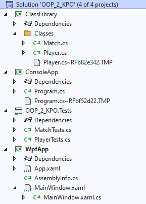

c# wpf akasztófa játék: 



4 játékrész van:

bal felül a feladvány az "Akasztófa" címmel

bal alul a betűgombok

jobb felül  Valami info...

jobb alul az akasztófa frame-jeinek a helye 11 hibalehetőséggel

Ha megnyom egy betűgombot és 

-ha benne van a szóban akkor a megnyomott betű háttere változzon zöldre, ne legyen nyomható és frissítse a szót bal felül

-ha nincs benne a szóban akkor a megnyomott betű háttere változzon szürkére, ne legyen nyomható, és a következő akasztófa fázist töltse be jobb alulra.

A szavak, kifejezések maximum 20 hosszúak legyenek (szóköz, kötőjel,...  ne legyen benne), amik egy szavak.txt fájlból kerülnek betöltésre.

A kezdeti szómegjelölés is gombokkal legyen megoldva, alap Content = "_", majd ha benne van a kiválasztott betű, akkor a "_" íródjon át a megfelelő betűre.

Ötletek:
```
List<Button> gombok = new List<Button>();

for (int i = 0; i < word.Length; i++)
{
    Button btn = new Button();
    btn.Content = "_";
    btn.Tag = word[i].ToString();
    btn.Name = "LetterButton" + i;
    gombok.Add(btn);

    Hozzáadás a Grid-hez
    wordGrid.Children.Add(btn);
    Grid.SetColumn(btn, i); // Beállítja a gomb oszlopát
}
```

kép betöltés 
```
HangmanImage.Source = new BitmapImage(new Uri($"Images/akasztofa{errorCounter}.png", UriKind.Relative));
```
