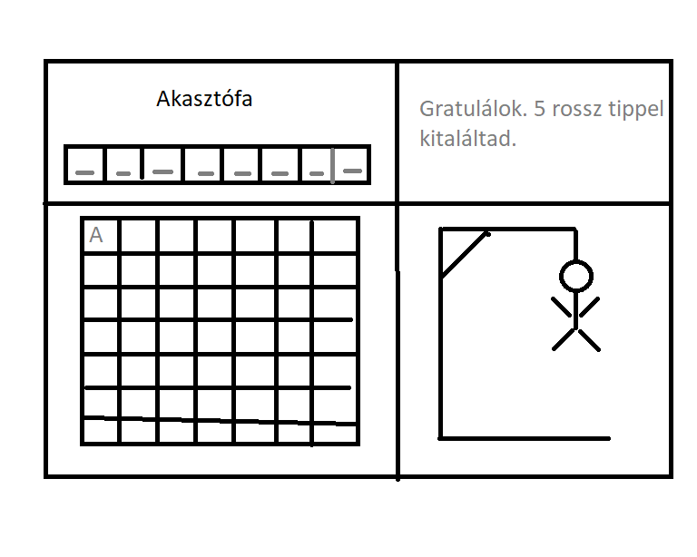

c# wpf akasztófa játék: 



4 játékrész van:

bal felül a feladvány az "Akasztófa" címmel

bal alul a betűgombok

jobb felül  Valami info...

jobb alul az akasztófa frame-jeinek a helye 11 hibalehetőséggel

Ha megnyom egy betűgombot, a továbbiakban ne legyen nyomható és 

-ha benne van a szóban, akkor frissítse a szót bal felül

-ha nincs benne a szóban, akkor a következő akasztófa fázist töltse be jobb alulra.

A szavak, kifejezések maximum 20 hosszúak legyenek (szóköz, kötőjel,...  ne legyen benne), amik egy szavak.txt fájlból kerülnek betöltésre.

A kezdeti szómegjelölés is lehet gombokkal megoldva (de lehet akár TextBlock is), alap Content = "_", majd ha benne van a kiválasztott betű, akkor a "_" íródjon át a megfelelő betűre.

Ötletek:
```
List<Button> gombok = new List<Button>();

for (int i = 0; i < word.Length; i++)
{
    Button btn = new Button();
    btn.Content = "_";
    btn.Tag = word[i].ToString();
    btn.Name = "LetterButton" + i;
    gombok.Add(btn);

    Hozzáadás a Grid-hez
    wordGrid.Children.Add(btn);
    Grid.SetColumn(btn, i); // Beállítja a gomb oszlopát
}
```

kép betöltés 
```
HangmanImage.Source = new BitmapImage(new Uri($"Images/akasztofa{errorCounter}.png", UriKind.Relative));
```


Megoldás:
1. Játéktér megtervezése
Lesz egy 2x2-es azonos méretű Grid, ami az ablakfelosztást adja:

```
<Grid>
    <Grid.ColumnDefinitions>
        <ColumnDefinition Width="*"/>
        <ColumnDefinition Width="*"/>
    </Grid.ColumnDefinitions>
    <Grid.RowDefinitions>
        <RowDefinition Height="*"/>
        <RowDefinition Height="*"/>
    </Grid.RowDefinitions>
    ...
</Grid>
```

A feladvány megjelenítését egy TextBlock-kal fogjuk megoldani a bal felső cellában.
```
<TextBlock x:Name="WordTextBlock" Grid.Row="0" Grid.Column="0" HorizontalAlignment="Center" VerticalAlignment="Center" FontSize="24"/>
```

A betűgombok megjelenítését dinamikusan fogjuk megoldani, ennek előkészítéseképp egy 7soros 5 oszlopos Gridet készítünk elő.

```
<UniformGrid x:Name="LetterButtonsUniformGrid" Grid.Row="1" Grid.Column="0" Rows="7" Columns="5" HorizontalAlignment="Center" VerticalAlignment="Center"/>
```

A jobb felső sarokban egy kis információt jelenítünk meg és az Új játék gombot, ha vége van egy játéknak
```
<TextBlock x:Name="InfoTextBlock" Grid.Row="0" Grid.Column="1" HorizontalAlignment="Center" VerticalAlignment="Center" FontSize="18"/>
<Button x:Name="NewGameButton" Grid.Row="0" Grid.Column="1" Content="Új játék" HorizontalAlignment="Center" VerticalAlignment="Bottom" Margin="10" Padding="10,5" Click="NewGameButton_Click" Visibility="Collapsed"/>
```

A jobb alsó sarokban az akasztófa frame-jei fognak képként megjelenni:
```
<Image x:Name="HangmanImage" Grid.Row="1" Grid.Column="1" HorizontalAlignment="Center" VerticalAlignment="Center"/>
```
2. Változók és konstruktor

```
private List<string> words = new List<string>();
private string selectedWord;

private List<char> chosenLetters = new List<char>();
private int errorCounter = 0;

public MainWindow()
{
    InitializeComponent();
    LoadWords();
    NewGame();
}
```

3. Szavak betöltése: A szavak a szavak.txt fájlból kerülnek betöltésre.
```
private void LoadWords()
{
    try
    {
        words = File.ReadAllLines("szavak.txt").ToList();
    }
    catch (Exception ex)
    {
        MessageBox.Show("Hiba a szavak betöltésekor: " + ex.Message);
    }
}
```

4. Új játék indítása: Véletlenszerűen kiválaszt egy szót, inicializálja a tippelt betűket és a hibaszámlálót.
```
private void NewGame()
{
    if (words.Count == 0)
    {
        MessageBox.Show("Nincsenek szavak a fájlban!");
        return;
    }

    Random rand = new Random();
    selectedWord = words[rand.Next(words.Count)].ToUpper();
    chosenLetters.Clear();
    errorCounter = 0;

    RefreshWord();
    RefreshLetterButtons();
    RefreshImage();
    InfoTextBlock.Text = "Új játék kezdődött!";
}
```

5. Feladvány frissítése: Megjeleníti a tippelt betűket és az üres helyeket.
```
private void RefreshWord()
{
    //WordTextBlock.Text = string.Join(" ", selectedWord.Select(c => chosenLetters.Contains(c) ? c.ToString() : "_"));

    string text = "";

    foreach (char c in selectedWord)
    {
        if (chosenLetters.Contains(c))
        {
            text += c;
        }
        else
        {
            text += '_';
        }
        text += ' ';
    }

    // Az utolsó felesleges szóköz eltávolítása
    if (text.Length > 0)
    {
        text = text.TrimEnd();
    }

    WordTextBlock.Text = text;

}
```

6. Betűgombok frissítése: Létrehozza a betűgombokat, és beállítja az eseménykezelőt a kattintásokhoz.
```
private void RefreshLetterButtons()
{
    LetterButtonsUniformGrid.Children.Clear();
    char[] letters = "AÁBCDEÉFGHIÍJKLMNOÓÖŐPQRSTUÚÜŰVWXYZ".ToCharArray();

    foreach (char letter in letters)
    {
        Button button = new Button
        {
            Content = letter.ToString(),
            Margin = new Thickness(5),
            IsEnabled = !chosenLetters.Contains(letter)
        };
        button.Click += LetterButton_Click;
        LetterButtonsUniformGrid.Children.Add(button);
    }
}
```
button.Click += LetterButton_Click; Ez a szintaxis hozzáad egy új eseménykezelőt a Click eseményhez. Ez azt jelenti, hogy ha már van más eseménykezelő is hozzárendelve a Click eseményhez, akkor az új eseménykezelő is meghívásra kerül, amikor az esemény bekövetkezik. Ez a szintaxis lehetővé teszi több eseménykezelő hozzáadását ugyanahhoz az eseményhez. Az += operátor használata tehát biztosítja, hogy az összes korábban hozzárendelt eseménykezelő is meghívásra kerüljön, míg az = operátor csak az utoljára hozzárendelt eseménykezelőt hagyja meg.

7. Betűgomb kattintás kezelése: Kezeli a betűgombok kattintását, frissíti a feladványt és a képet, valamint ellenőrzi a játék állapotát.

```
private void LetterButton_Click(object sender, RoutedEventArgs e)
{
    Button button = sender as Button;
    char letter = button.Content.ToString()[0];
    chosenLetters.Add(letter);

    if (selectedWord.Contains(letter))
    {
        RefreshWord();
        if (!WordTextBlock.Text.Contains("_"))
        {
            InfoTextBlock.Text = "Gratulálok, nyertél!";
            DisabledButtons();
            NewGameButton.Visibility = Visibility.Visible;
        }
    }
    else
    {
        errorCounter++;
        RefreshImage();
        if (errorCounter >= 10)
        {
            InfoTextBlock.Text = "Vesztettél! A szó: " + selectedWord;
            DisabledButtons();
            NewGameButton.Visibility = Visibility.Visible;
        }
    }
    button.IsEnabled = false;
}
```

8. Kép frissítése: Frissíti a képet a hibaszámláló alapján.

A fájlokat hozzá kell adni a projekthez:

Solution Explorer/Projekt/Add Folder: Images

Images/Add Existing Item...: összes képfájl kijelölése és Add

Solution Explorer/Images/képfájlok/Properties/Build Action: Content és Copy to Output Directory: Copy if newer vagy Copy always


```
private void RefreshImage()
{
    HangmanImage.Source = new BitmapImage(new Uri($"Images/akasztofa{hibaSzamlalo:D2}.png", UriKind.Relative));
}
```

9. Gombok letiltása: Letiltja az összes betűgombot, amikor a játék véget ér.
```
private void DisabledButtons()
{
    foreach (UIElement elem in BetuGombokGrid.Children)
    {
        if (elem is Button button)
        {
            button.IsEnabled = false;
        }
    }
}
```

10. Új játék gomb kezelése: Új játékot indít, amikor az új játék gombra kattintanak.
```
private void NewGameButton_Click(object sender, RoutedEventArgs e)
{
    NewGame();
    NewGameButton.Visibility = Visibility.Collapsed;
}
```
