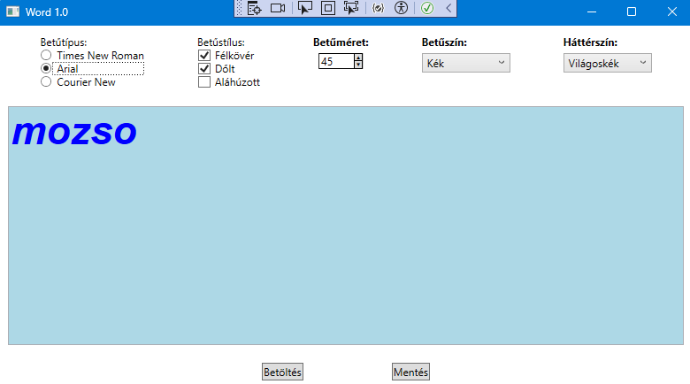

# WORD 1.0 - Szövegszerkesztő alkalmazás készítése WPF-ben



Feladat: Készíts egy egyszerű szövegszerkesztő alkalmazást (Wpf_1_WORD1_0), amely lehetővé teszi a szöveg formázását és a szöveg formázás nélküli betöltését és mentését.

Felhasználói felület kialakítása:
A főablak (MainWindow) tartalmazzon egy Grid elrendezést három sorral:
Az első sorban helyezz el különböző vezérlőelemeket a betűtípus, betűstílus, (+ betűméret,) betűszín és háttérszín kiválasztásához.
A második sorban legyen egy TextBox vezérlőelem, amelyben a felhasználó szerkesztheti a szöveget.
A harmadik sorban helyezz el két gombot a szöveg betöltéséhez és mentéséhez.

Betűtípus kiválasztása:
Helyezz el három RadioButton vezérlőelemet a következő betűtípusok kiválasztásához: Times New Roman, Arial, Courier New.
Az eseménykezelőben (FontType_Checked) állítsd be a TextBox betűtípusát a kiválasztott értéknek megfelelően.

Betűstílus kiválasztása:
Helyezz el három CheckBox vezérlőelemet a következő betűstílusok kiválasztásához: Félkövér, Dőlt, Aláhúzott.
Az eseménykezelőben (FontStyle_Checked) állítsd be a TextBox betűstílusát a kiválasztott értékeknek megfelelően.

+Betűméret kiválasztása (*):
Helyezz el egy NumericUpDown vezérlőelemet a betűméret kiválasztásához.
Az eseménykezelőben (FontSize_ValueChanged) állítsd be a TextBox betűméretét a kiválasztott értéknek megfelelően.

Színek kiválasztása:
Helyezz el két ComboBox vezérlőelemet a betűszín és a háttérszín kiválasztásához.
Az eseménykezelőkben (FontColor_SelectionChanged és BackgroundColor_SelectionChanged) állítsd be a TextBox betűszínét és háttérszínét a kiválasztott értékeknek megfelelően.

Szöveg betöltése és mentése:
Helyezz el két gombot a szöveg betöltéséhez és mentéséhez.
Az eseménykezelőkben (Load_Click és Save_Click) valósítsd meg a fájlok betöltését és mentését Dialog-okkal.


(*) NumericUpDown telepítése:

1. Solution Explorer / projekt nevének gyorsmenüje / "Manage NuGet Packages..."
2. Browse: "NumericUpDown", és telepítsd
3. Az xaml-be be kell írni egy deklarációt, ehhez menj a View / Object Browser / NumericUpDown -ra. Itt állapítsd meg az Assembly nevét (NumericUpDown) és a namespace nevét (ControlLib), majd az alábbi sort szúrd be a xaml fejlécébe:
```
xmlns:nud="clr-namespace:ControlLib;assembly=NumericUpDown"
```
itt egyébként a tulajdonságait és az eseményeit is meg tudod nézni. Pl: Value
4. Szintén az xaml-ben a megfelelő helyre be tudod szúrni a vezérlőt:
```
<nud:NumericUpDown Name="nudFontSize" MinValue="8" MaxValue="72" Value="14" ValueChanged="FontSize_ValueChanged" Width="50"/>
```
5. Az Eventlistában ki kell keresni a ValueChange-t, amit szintén az Object Browser-ből látunk és itt 2x kell kattintani, majd megírni az eseménykezelőt:
```
private void FontSize_ValueChanged(object sender, ControlLib.ValueChangedEventArgs e)
{
    if (txtEditor != null && nudFontSize.Value != null)
    {
        txtEditor.FontSize = nudFontSize.Value;
    }
}
```

(**) Biztosítsuk, hogy a szöveg mellett a formázási információk is mentésre kerüljenek és visszatöltődjenek.

Ehhez ötlet:

Az XmlDocument osztály az XML dokumentumok kezelésére szolgál a .NET keretrendszerben. Lehetővé teszi az XML dokumentumok betöltését, módosítását és mentését. Íme néhány fontosabb részlet róla:

Betöltés: Az XmlDocument osztály segítségével könnyedén betölthetsz egy XML fájlt. Ehhez használhatod a Load metódust, amely betölti az XML tartalmát egy XmlDocument objektumba.
```
var xmlDoc = new System.Xml.XmlDocument();
xmlDoc.Load("path/to/your/file.xml");
```


Navigálás: Az XmlDocument objektum lehetővé teszi az XML elemek és attribútumok elérését és módosítását. Például a SelectSingleNode metódussal kiválaszthatsz egy adott elemet XPath kifejezéssel.
```
var textNode = xmlDoc.SelectSingleNode("/document/text");
string textContent = textNode.InnerText;
```

Módosítás: Az XmlDocument segítségével módosíthatod az XML tartalmát. Például beállíthatod egy elem szövegét vagy hozzáadhatsz új elemeket.

```
textNode.InnerText = "New Text Content";
```

Mentés: Az XmlDocument objektumot vissza is mentheted egy fájlba a Save metódussal.

```
xmlDoc.Save("path/to/your/file.xml");
```


(***)
A fájl kiterjesztésével jelezzük, hogy XML dokumentumról van szó a SaveFileDialog beállításaival. Például, beállíthatod az alapértelmezett kiterjesztést és a szűrőt, hogy csak XML fájlokat lehessen menteni és betölteni.


Ehhez használhatjuk az objektuminicializálót:

```
OpenFileDialog openFileDialog = new OpenFileDialog
{
    DefaultExt = ".xml",
    Filter = "XML files (*.xml)|*.xml"
};
```

Ez a szintaxis szintén egy új OpenFileDialog objektumot hoz létre az alapértelmezett konstruktor segítségével, de az objektum inicializáló szintaxist használja a tulajdonságok beállítására közvetlenül az objektum létrehozása után. Ez egy kényelmesebb és olvashatóbb módja az objektum tulajdonságainak beállítására.


(****)
A fájl mindig .xml kiterjesztéssel legyen mentve!


(*****)
Oldjuk meg, hogy csak a mi xml fájlunkat tudja megnyitni!


```xaml
<Window x:Class="Wpf_1_Word1.MainWindow"
        xmlns="http://schemas.microsoft.com/winfx/2006/xaml/presentation"
        xmlns:x="http://schemas.microsoft.com/winfx/2006/xaml"
        xmlns:d="http://schemas.microsoft.com/expression/blend/2008"
        xmlns:mc="http://schemas.openxmlformats.org/markup-compatibility/2006"
        xmlns:nud="clr-namespace:ControlLib;assembly=NumericUpDown"
        xmlns:local="clr-namespace:Wpf_1_Word1"
        mc:Ignorable="d"
        Title="MainWindow" Height="450" Width="800">
    <Grid>
        <Grid.RowDefinitions>
            <RowDefinition/>
            <RowDefinition Height="*"/>
            <RowDefinition/>
        </Grid.RowDefinitions>
        <StackPanel Grid.Row="0" Orientation="Horizontal" HorizontalAlignment="Center" Margin="10">
            <StackPanel Margin="30,0,30,0">
                <TextBlock Text="Betutipus"/>
                <RadioButton x:Name="TimesNewRomanRadioButton" GroupName="FontFamily" Content="Times New Roman" IsChecked="True" Checked="FontFamily_Checked"/>
                <RadioButton x:Name="ArialRadioButton" GroupName="FontFamily" Content="Arial" Checked="FontFamily_Checked"/>
                <RadioButton x:Name="CourierNewRadioButton" GroupName="FontFamily" Content="Courier New" Checked="FontFamily_Checked"/>
            </StackPanel>
            <StackPanel Margin="30,0,30,0">
                <TextBlock Text="Betustilus"/>
                <CheckBox x:Name="BoldCheckBox" Content="Félkövér" Checked="FontStyle_Checked" Unchecked="FontStyle_Checked"/>
                <CheckBox x:Name="ItalicCheckBox" Content="Dölt" Checked="FontStyle_Checked" Unchecked="FontStyle_Checked" />
                <CheckBox x:Name="UnderlinedCheckBox" Content="Aláhúzott" Checked="FontStyle_Checked" Unchecked="FontStyle_Checked"/>
            </StackPanel>
            <StackPanel Margin="30,0,30,0">
                <TextBlock Text="Betűméret"/>
                <nud:NumericUpDown x:Name="nudFontSize" MinValue="8" MaxValue="72" Value="14" ValueChanged="FontSize_ValueChanged" Width="50"/>
            </StackPanel>
            <StackPanel Margin="30,0,30,0">
                <TextBlock Text="Betűszín" />
                <ComboBox SelectedIndex="0" SelectionChanged="ComboBox_SelectionChanged" Width="100">
                    <ComboBoxItem Content="Kék" Tag="Blue"/>
                    <ComboBoxItem Content="Zöld" Tag="Green"/>
                    <ComboBoxItem Content="Piros" Tag="Red"/>
                    <ComboBoxItem Content="Fekete" Tag="Black"/>
                </ComboBox>
            </StackPanel>
            <StackPanel Margin="30,0,30,0">
                <TextBlock Text="Háttérszín" />
                <ComboBox x:Name="BackgroundComboBox" SelectedIndex="0" SelectionChanged="BackgroundComboBox_SelectionChanged" Width="100">
                    <ComboBoxItem Content="Fehér" Tag="White"/>
                    <ComboBoxItem Content="Sárga" Tag="Yellow"/>
                    <ComboBoxItem Content="Szürke" Tag="Gray"/>
                    <ComboBoxItem Content="VilágosKék" Tag="LightBlue"/>
                </ComboBox>
            </StackPanel>
        </StackPanel>
        <StackPanel Grid.Row="1">
            <TextBox x:Name="TextTextBox" TextWrapping="Wrap" Text="TextBox" Width="800" Height="145" FontFamily="Times New Roman"/>
        </StackPanel>
        <StackPanel Grid.Row="2" Orientation="Horizontal" HorizontalAlignment="Center">
            <Button x:Name="LoadButton" Content="Betöltés" Height="30" Padding="10,5,10,5" Margin="0,0,100,0" Click="LoadButton_Click"/>
            <Button x:Name="SaveButton" Content="Mentés" Height="30" Padding="10,5,10,5"  Margin="100,0,0,0" Click="SaveButton_Click"/>
        </StackPanel>


    </Grid>
</Window>

```


```cs
using Microsoft.Win32;
using System.Printing;
using System.Text;
using System.Windows;
using System.Windows.Controls;
using System.Windows.Data;
using System.Windows.Documents;
using System.Windows.Input;
using System.Windows.Media;
using System.Windows.Media.Imaging;
using System.Windows.Navigation;
using System.Windows.Shapes;
using System.IO;

namespace Wpf_1_Word1
{
    /// <summary>
    /// Interaction logic for MainWindow.xaml
    /// </summary>
    public partial class MainWindow : Window
    {
        public MainWindow()
        {
            InitializeComponent();
        }

        private void FontFamily_Checked(object sender, RoutedEventArgs e)
        {
            if (sender is RadioButton radio && TextTextBox != null)
            {
                TextTextBox.FontFamily = new FontFamily(radio.Content.ToString());
            }
        }

        private void FontStyle_Checked(object sender, RoutedEventArgs e)
        {
            if (sender is CheckBox checkbox)
            {
                string style = checkbox.Content.ToString();
                if (style == "Félkövér")
                {
                    TextTextBox.FontWeight = checkbox.IsChecked == true ? FontWeights.Bold : FontWeights.Normal;
                }
                else if (style == "Dölt")
                {
                    TextTextBox.FontStyle = checkbox.IsChecked == true ? FontStyles.Italic : FontStyles.Normal;
                }
                else if (style == "Aláhúzott")
                {
                    TextTextBox.TextDecorations = checkbox.IsChecked == true ? TextDecorations.Underline : null;
                }
            }
        }

        private void FontSize_ValueChanged(object sender, ControlLib.ValueChangedEventArgs e)
        {
            if (TextTextBox != null && nudFontSize.Value != null)
            {
                TextTextBox.FontSize = nudFontSize.Value;
            }
        }

        private void ComboBox_SelectionChanged(object sender, SelectionChangedEventArgs e)
        {
            if (TextTextBox != null && sender is ComboBox comboBox  && comboBox.SelectedItem is ComboBoxItem selectedItem)
            {
                string color= selectedItem.Tag.ToString();
                TextTextBox.Foreground = new SolidColorBrush((Color)ColorConverter.ConvertFromString(color));
            }
            
        }

        private void BackgroundComboBox_SelectionChanged(object sender, SelectionChangedEventArgs e)
        {
            if (TextTextBox != null && sender is ComboBox comboBox && comboBox.SelectedItem is ComboBoxItem selectedItem)
            {
                string color = selectedItem.Tag.ToString();
                TextTextBox.Background = new SolidColorBrush((Color)ColorConverter.ConvertFromString(color));
            }
        }

        private void SaveButton_Click(object sender, RoutedEventArgs e)
        {
            SaveFileDialog saveFileDialog = new SaveFileDialog
            {
                DefaultExt = ".xml",
                Filter = "XML files (*.xml)|*.xml"
            };
            if (saveFileDialog.ShowDialog() == true)
            {
                string xmlContent = "<document>\n" +
                                    "<identifier>mozso_xml</identifier>\n" +
                                    $"<text>{TextTextBox.Text}</text>\n" +
                                    $"<fontfamily>{TextTextBox.FontFamily}</fontfamily>\n" +
                                    $"<fontsize>{TextTextBox.FontSize}</fontsize>\n" +
                                    $"<fontweight>{TextTextBox.FontWeight}</fontweight>\n" +
                                    $"<fontstyle>{TextTextBox.FontStyle}</fontstyle>\n" +
                                    $"<textdecorations>{(TextTextBox.TextDecorations == TextDecorations.Underline ? "Underline" : "None")}</textdecorations>\n" +
                                    $"<foreground>{TextTextBox.Foreground}</foreground>\n" +
                                    $"<background>{TextTextBox.Background}</background>\n" +
                                    "</document>";
        
                string fileName = saveFileDialog.FileName.Split('.')[0];
                if (!fileName.EndsWith(".xml"))
                {
                    fileName += ".xml";
                }
                File.WriteAllText(fileName, xmlContent);
                MessageBox.Show("A mentés megtörtént.");
            }
        
        }
        
        private void LoadButton_Click(object sender, RoutedEventArgs e)
        {
            OpenFileDialog openFileDialog = new OpenFileDialog
            {
                DefaultExt = ".xml",
                Filter = "XML files (*.xml)|*.xml"
            };
            if (openFileDialog.ShowDialog() == true)
            {
                string xmlContent = File.ReadAllText(openFileDialog.FileName);
                var xmlDoc = new System.Xml.XmlDocument();
                xmlDoc.LoadXml(xmlContent);
        
                var identifierNode = xmlDoc.SelectSingleNode("/document/identifier");
                if (identifierNode == null || identifierNode.InnerText != "mozso_xml")
                {
                    MessageBox.Show("Hibás fájlformátum.");
                    return;
                }
        
                TextTextBox.Text = xmlDoc.SelectSingleNode("/document/text").InnerText;
                TextTextBox.FontFamily = new FontFamily(xmlDoc.SelectSingleNode("/document/fontfamily").InnerText);
                TextTextBox.FontSize = double.Parse(xmlDoc.SelectSingleNode("/document/fontsize").InnerText);
                TextTextBox.FontWeight = (FontWeight)new FontWeightConverter().ConvertFromString(xmlDoc.SelectSingleNode("/document/fontweight").InnerText);
                TextTextBox.FontStyle = (FontStyle)new FontStyleConverter().ConvertFromString(xmlDoc.SelectSingleNode("/document/fontstyle").InnerText);
                TextTextBox.TextDecorations = xmlDoc.SelectSingleNode("/document/textdecorations").InnerText == "Underline" ? TextDecorations.Underline : null;
                TextTextBox.Foreground = (Brush)new BrushConverter().ConvertFromString(xmlDoc.SelectSingleNode("/document/foreground").InnerText);
                TextTextBox.Background = (Brush)new BrushConverter().ConvertFromString(xmlDoc.SelectSingleNode("/document/background").InnerText);
            }
        
        }
    }
}
```

