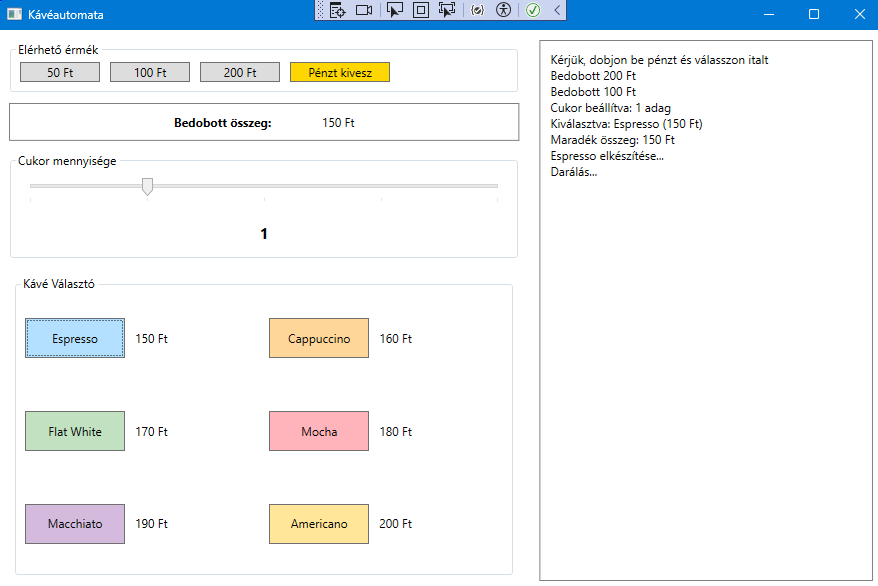

# Coffee Machine - Kávéautomata készítése WPF-ben



Feladat: Készíts egy kávéautomata szimulátort (Wpf_1_coffe_machine), amely lehetővé tesz 6 különböző kávéfajtából történő választást.

[Letöltés: Wpf_1_coffee_machine.exe](https://github.com/m0zs0/OOP-CS/raw/main/EXE/Wpf_1_coffee_machine.exe)


```xaml
<Window x:Class="Wpf_1_coffee_machine.MainWindow"
        xmlns="http://schemas.microsoft.com/winfx/2006/xaml/presentation"
        xmlns:x="http://schemas.microsoft.com/winfx/2006/xaml"
        xmlns:d="http://schemas.microsoft.com/expression/blend/2008"
        xmlns:mc="http://schemas.openxmlformats.org/markup-compatibility/2006"
        xmlns:local="clr-namespace:Wpf_1_coffee_machine"
        mc:Ignorable="d"
        Title="MainWindow" Height="450" Width="800">
    <Grid>
        <Grid.ColumnDefinitions>
            <ColumnDefinition/>
            <ColumnDefinition/>
        </Grid.ColumnDefinitions>
        <Grid x:Name="InteractionsGrid" Grid.Column="0">
            <Grid.RowDefinitions>
                <RowDefinition/>
                <RowDefinition/>
                <RowDefinition/>
            </Grid.RowDefinitions>
            
            <!--COIN PART-->
            <StackPanel Grid.Row="0">
                <GroupBox Header="Elérhető érmék" BorderBrush="Black" Height="80">
                    <StackPanel Orientation="Horizontal">
                        <Button x:Name="Button50" Content="50ft" Margin="10,0,0,10" Height="20"/>
                        <Button x:Name="Button100" Content="100ft" Margin="10,0,0,10" Height="20"/>
                        <Button x:Name="Button200" Content="200ft" Margin="10,0,0,10" Height="20"/>
                        <Button x:Name="ButtonOut" Content="Pénzt kivesz" Margin="10,0,0,10" Height="20"/>
                    </StackPanel>
                </GroupBox>
                <Border BorderBrush="Black" BorderThickness="1" Height="40">
                    <StackPanel Orientation="Horizontal" HorizontalAlignment="Center" VerticalAlignment="Center">
                        <TextBlock Text="Bedobott összeg:"/>
                        <TextBlock x:Name="MoneyTextBlock" Text="0"/>
                    </StackPanel>
                </Border>
            </StackPanel>
            
            <!--SUGAR PART-->
            <GroupBox Header="Cukor mennyisége" Grid.Row="1">
                <StackPanel>
                    <Slider x:Name="SugarSlider" Maximum="4" Value="0"/>
                    <TextBlock Text="1" HorizontalAlignment="Center" />
                </StackPanel>
            </GroupBox>
            
            <!--COFFEE PART-->
            <GroupBox Header="Kávé választó" Grid.Row="2">
                <StackPanel Orientation="Horizontal">
                    <StackPanel HorizontalAlignment="Left" VerticalAlignment="Center" Height="120" Width="200">
                        <StackPanel Orientation="Horizontal" Margin="10,5,0,10">
                            <Button x:Name="EspressoButton" Content="Espresso" Height="30" Width="70" Background="#FF1CBBF1"/>
                            <TextBlock Text="150ft" VerticalAlignment="Center" Margin="15,0,0,0"/>
                        </StackPanel>
                        <StackPanel Orientation="Horizontal" Margin="10,0,0,10">
                            <Button x:Name="FlatWhiteButton" Content="Flat White" Height="30" Width="70" Background="#FF3AB85D"/>
                            <TextBlock Text="170ft" VerticalAlignment="Center" Margin="15,0,0,0"/>
                        </StackPanel>
                        <StackPanel Orientation="Horizontal" Margin="10,0,0,10">
                            <Button x:Name="MacchiatoButton" Content="Macchiato" Height="30" Width="70" Background="#FF790CC5"/>
                            <TextBlock Text="190ft" VerticalAlignment="Center" Margin="15,0,0,0"/>
                        </StackPanel>
                    </StackPanel>
                    
                    <StackPanel HorizontalAlignment="Left" VerticalAlignment="Center" Height="120" Width="198" >
                        <StackPanel Orientation="Horizontal" Margin="10,5,0,10">
                            <Button x:Name="CappuccinoButton" Content="Cappuccino" Height="30" Width="70" Background="#FFFFB002"/>
                            <TextBlock Text="160ft" VerticalAlignment="Center" Margin="15,0,0,0"/>
                        </StackPanel>
                        <StackPanel Orientation="Horizontal" Margin="10,0,0,10">
                            <Button x:Name="MochaButton" Content="Mocha" Height="30" Width="70" Background="#FFAB2727"/>
                            <TextBlock Text="180ft" VerticalAlignment="Center" Margin="15,0,0,0"/>
                        </StackPanel>
                        <StackPanel Orientation="Horizontal" Margin="10,0,0,10">
                            <Button x:Name="AmericanoButton" Content="Americano" Height="30" Width="70" Background="#FFBCD244"/>
                            <TextBlock Text="200ft" VerticalAlignment="Center" Margin="15,0,0,0"/>
                        </StackPanel>
                    </StackPanel>
                </StackPanel>
            </GroupBox>
            
        </Grid>
        <TextBlock x:Name="InfoTextBlock" Grid.Column="1"/>
    </Grid>
    
</Window>
```

```c#
using System.Text;
using System.Windows;
using System.Windows.Controls;
using System.Windows.Data;
using System.Windows.Documents;
using System.Windows.Input;
using System.Windows.Media;
using System.Windows.Media.Imaging;
using System.Windows.Navigation;
using System.Windows.Shapes;

namespace Wpf_1_coffee_machine
{
    /// <summary>
    /// Interaction logic for MainWindow.xaml
    /// </summary>
    public partial class MainWindow : Window
    {
        public MainWindow()
        {
            InitializeComponent();
        }
    }
}
```
